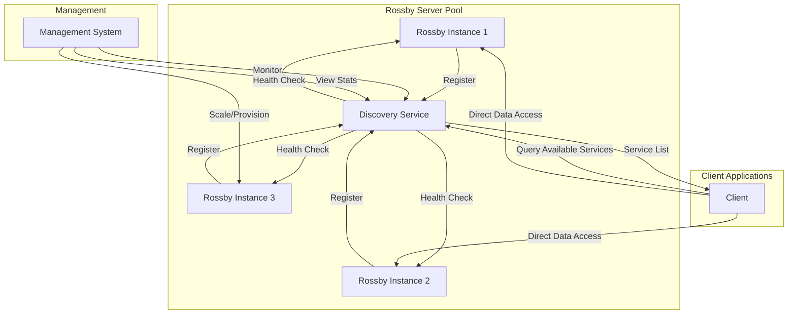

# Rossby Implementation Plan

## Overview

This document outlines the detailed implementation plan for rossby, a high-performance, in-memory NetCDF-to-API server. The plan incorporates feedback and enhancements discussed during the planning phase.

## Project Goals

1. **Zero-configuration NetCDF serving**: Load any NetCDF file and instantly serve it via HTTP API
2. **Blazing-fast performance**: In-memory data storage with microsecond query latency
3. **Rich interpolation support**: Multiple interpolation methods for flexible data access
4. **Beautiful visualizations**: Matplotlib-inspired colormaps for image generation
5. **Production-ready code**: Comprehensive testing, error handling, and documentation

## Architecture Overview

```mermaid
graph TB
    subgraph "Data Layer"
        NC[NetCDF File] --> DL[Data Loader]
        DL --> MD[Metadata]
        DL --> ND[ndarray Data]
        MD --> AS[Arc<AppState>]
        ND --> AS
    end
    
    subgraph "API Layer"
        CLI[CLI Parser] --> CFG[Config]
        CFG --> SRV[Axum Server]
        AS --> SRV
        SRV --> EP1[/metadata]
        SRV --> EP2[/point]
        SRV --> EP3[/image]
        SRV --> EP4[/heartbeat]
    end
    
    subgraph "Processing"
        EP2 --> INT[Interpolation Engine]
        INT --> NN[Nearest]
        INT --> BL[Bilinear]
        INT --> BC[Bicubic]
        
        EP3 --> IMG[Image Renderer]
        IMG --> CM[Colormap Engine]
        CM --> VIR[viridis]
        CM --> PLM[plasma]
        CM --> CW[coolwarm]
    end
    
    subgraph "Service Discovery"
        SD[Discovery Module] --> RG[Registration Client]
        CFG --> SD
        SRV --> SD
        RG -->|HTTP POST| DS[Discovery Service]
        EP4 <-->|Health Check| DS
    end
```

### Service Discovery Architecture



## Implementation Phases

### Phase 1: Project Foundation (Day 1)

**Goal**: Set up the project structure and core dependencies

1. **Update Cargo.toml** with dependencies:
   - Core: `axum`, `tokio`, `netcdf`, `ndarray`
   - CLI: `clap`, `serde`, `serde_json`
   - Image: `image`, `colorgrad`
   - Utils: `thiserror`, `tracing`, `anyhow`
   - Dev: `criterion`, `reqwest`, `tempfile`

2. **Create project structure**:
   ```
   src/
   ├── main.rs              # Entry point
   ├── lib.rs               # Library root
   ├── config.rs            # Configuration
   ├── error.rs             # Error types
   ├── state.rs             # Application state
   ├── data_loader.rs       # NetCDF loading
   ├── handlers/
   │   ├── mod.rs
   │   ├── metadata.rs
   │   ├── point.rs
   │   └── image.rs
   ├── interpolation/
   │   ├── mod.rs
   │   ├── nearest.rs
   │   ├── bilinear.rs
   │   ├── bicubic.rs
   │   └── common.rs
   └── colormaps/
       ├── mod.rs
       ├── sequential.rs
       ├── diverging.rs
       └── colormap.rs
   ```

3. **Set up CI/CD** (.github/workflows/ci.yml):
   - Format check (`cargo fmt --check`)
   - Lint (`cargo clippy -- -D warnings`)
   - Test (`cargo test`)
   - Build (`cargo build --release`)

### Phase 2: Test Infrastructure (Day 2)

**Goal**: Create robust testing utilities

1. **Test data generator** (tests/common/test_data.rs):
   ```rust
   // Generate various test patterns
   pub fn create_linear_gradient_nc(path: &Path, size: (usize, usize))
   pub fn create_sinusoidal_nc(path: &Path, size: (usize, usize))
   pub fn create_gaussian_blob_nc(path: &Path, size: (usize, usize))
   pub fn create_test_weather_nc(path: &Path) // Realistic weather data
   ```

2. **Test utilities**:
   - HTTP client helpers
   - Assertion helpers for floating-point comparisons
   - Image comparison utilities

### Phase 3: Core Infrastructure (Days 3-4)

**Goal**: Implement configuration, error handling, and data structures

1. **Configuration system** (config.rs):
   - CLI argument parsing with clap
   - JSON config file support
   - Environment variable support
   - Layered configuration merging

2. **Error handling** (error.rs):
   ```rust
   #[derive(thiserror::Error, Debug)]
   pub enum RossbyError {
       #[error("NetCDF error: {0}")]
       NetCdf(#[from] netcdf::Error),
       #[error("IO error: {0}")]
       Io(#[from] std::io::Error),
       #[error("Invalid coordinates: {message}")]
       InvalidCoordinates { message: String },
       // ... more variants
   }
   ```

3. **Application state** (state.rs):
   ```rust
   pub struct AppState {
       pub metadata: Metadata,
       pub data: HashMap<String, Array<f32, IxDyn>>,
       pub config: Config,
   }
   ```

### Phase 4: Data Layer (Days 5-6)

**Goal**: Implement NetCDF loading and in-memory storage

1. **NetCDF loader** (data_loader.rs):
   - Parse all metadata (dimensions, variables, attributes)
   - Load data into ndarray structures
   - Handle different data types and dimensions
   - Validate coordinate variables

2. **Coordinate system handling**:
   - Support for regular lat/lon grids
   - Handle longitude wrapping (0-360 vs -180-180)
   - Time dimension parsing

### Phase 5: Interpolation Engine (Days 7-9)

**Goal**: Implement multiple interpolation methods

1. **Common interpolation utilities** (interpolation/common.rs):
   - Coordinate to grid index mapping
   - Boundary handling
   - Weight calculation helpers

2. **Interpolation methods**:
   - **Nearest neighbor**: Simple, fast
   - **Bilinear**: 2x2 grid interpolation
   - **Bicubic**: 4x4 grid, smoother results
   - Each with comprehensive unit tests

3. **Performance optimizations**:
   - SIMD where applicable
   - Caching of interpolation weights
   - Parallel processing for batch queries

### Phase 6: Colormap System (Days 10-11)

**Goal**: Implement matplotlib-inspired colormaps

1. **Colormap trait** (colormaps/colormap.rs):
   ```rust
   pub trait Colormap {
       fn map(&self, value: f32, min: f32, max: f32) -> [u8; 4];
       fn name(&self) -> &str;
   }
   ```

2. **Sequential colormaps** (colormaps/sequential.rs):
   - viridis (default)
   - plasma
   - inferno
   - magma
   - cividis

3. **Diverging colormaps** (colormaps/diverging.rs):
   - coolwarm
   - RdBu
   - seismic

### Phase 7: API Implementation (Days 12-14)

**Goal**: Implement all HTTP endpoints

1. **Server setup** (main.rs):
   - Axum router configuration
   - Middleware (logging, CORS, etc.)
   - Graceful shutdown handling

2. **Endpoints**:
   - **GET /metadata**: Return file metadata
   - **GET /point**: Interpolated point queries
     - Parameters: lon, lat, time_index, vars, interpolation
   - **GET /image**: Dynamic image generation
     - Parameters: var, time_index, bbox, width, height, colormap, interpolation

3. **Response formats**:
   - JSON for metadata and point queries
   - PNG/JPEG for images
   - Proper error responses

### Phase 8: Advanced Geography Features (Days 15-16)

**Goal**: Enhancing the /image endpoint with geographic visualization capabilities

1. **Map Projection and BBox Improvements**:
   - Support for different map centering options:
     - Eurocentric (-180° to 180°)
     - America-centered (-90° to 270°)
     - Pacific-centered (0° to 360°)
     - Custom longitude centering
   - Proper handling of regions spanning the dateline or prime meridian
   - Consistent orientation with north at the top and south at the bottom

2. **Pole Enhancement**:
   - Reduce distortion in polar regions
   - Apply gradual enhancement based on latitude
   - Preserve data accuracy while improving visualization

3. **Interpolation Improvements**:
   - Automatic selection of interpolation method based on zoom level:
     - Bilinear for downsampling to prevent aliasing
     - Bicubic for significant upsampling for smoother results
   - User-selectable methods: nearest, bilinear, bicubic

### Phase 9: Integration Testing (Days 15-16)

**Goal**: Comprehensive integration tests

1. **API tests**:
   - Test each endpoint with various parameters
   - Error cases (invalid parameters, out of bounds)
   - Performance tests with large datasets

2. **End-to-end scenarios**:
   - Load file → query points → generate images
   - Multiple concurrent requests
   - Memory usage validation

### Phase 10: Performance & Optimization (Days 17-18)

**Goal**: Optimize for production use

1. **Benchmarking**:
   - Criterion benchmarks for interpolation
   - Load testing with large files
   - Memory profiling

2. **Optimizations**:
   - Lazy loading options for huge files
   - Caching strategies
   - Connection pooling

### Phase 11: Service Discovery & Management (Days 19-20)

**Goal**: Implement service discovery and management features

1. **Heartbeat Endpoint**:
   - Create a new `GET /heartbeat` endpoint in handlers/heartbeat.rs
   - Return JSON with server status information:
     - Server ID (unique instance identifier)
     - Uptime (time since server start)
     - Current timestamp
     - Memory usage statistics
     - Dataset information summary
   - Include basic health check functionality

2. **Service Registration**:
   - Add discovery URL configuration option:
     - CLI argument: `--discovery-url`
     - Environment variable: `ROSSBY_DISCOVERY_URL`
     - Config file parameter: `discovery_url`
   - Implement registration logic in a new module (`src/discovery.rs`)
   - Send POST request to discovery service with server details:
     - Server ID
     - Host/port information
     - Base URL
     - Metadata URL
     - File name and variable information
   - Add automatic re-registration on configurable intervals
   - Handle failed registrations with exponential backoff

3. **Management Infrastructure**:
   - Enhance AppState to track instance statistics
   - Add self-monitoring capabilities
   - Document the discovery protocol specification
   - Create example scripts for managing pools of Rossby servers

### Phase 12: Documentation & Polish (Days 21-22)

**Goal**: Production-ready documentation

1. **Code documentation**:
   - Comprehensive rustdoc comments
   - Examples in documentation

2. **User documentation**:
   - API reference with examples
   - Deployment guide
   - Performance tuning guide
   - Service discovery and clustering guide

## Testing Strategy

### Unit Tests
- Each module has comprehensive unit tests
- Edge cases and error conditions covered
- Mock data for isolated testing

### Integration Tests
- Full API lifecycle tests
- Generated test NetCDF files
- Performance regression tests

### Test Coverage Goals
- Minimum 80% code coverage
- 100% coverage for critical paths (interpolation, data loading)

## Performance Targets

- **Startup time**: < 10 seconds for 1GB file
- **Point query latency**: < 1ms (p99)
- **Image generation**: < 100ms for 1000x1000 image
- **Memory overhead**: < 20% above raw data size
- **Concurrent requests**: > 10,000 RPS on modern hardware

## Risk Mitigation

1. **Large file handling**: Implement streaming/chunked loading as fallback
2. **Memory constraints**: Add memory limit configuration
3. **Numerical precision**: Extensive testing with known values
4. **Concurrency issues**: Careful use of Arc and immutable data

## Success Criteria

1. ✅ All tests passing with > 80% coverage
2. ✅ Performance targets met
3. ✅ Zero clippy warnings
4. ✅ Comprehensive documentation
5. ✅ Successfully serves real-world NetCDF files
6. ✅ Positive user feedback on ease of use

## Timeline

- **Week 1**: Phases 1-3 (Foundation)
- **Week 2**: Phases 4-6 (Core functionality)
- **Week 3**: Phases 7-10 (API, testing, polish)

Total estimated time: 3 weeks for full implementation

## Next Steps

1. Create GitHub issues for each phase
2. Set up development environment
3. Begin Phase 1 implementation
